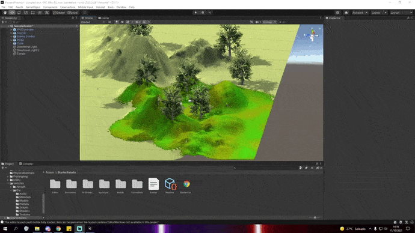

## Introducción a Unity

En el primer gif se muestran los objetos básicos(el cubo), los objetos complejos de Standard Assets(Ethan y el coche), un objeto libre de la Assets Store(Zombie) y el terreno creado. Por último se puede ver a la derecha como cada objeto tiene una etiqueta asignada.

En el segundo gif se muestran las dos fuentes de luz y el prefab para un FPS. Cuando pulsamos el botón de "Play" se ejecuta el script. Abajo en la consola se muestra el resultado. Primero imprime todos los GameObjects de la escena y les asigna un identificador junto a un contador que empieza en 0. Más tarde, por cada iteración actualiza el contador de los objetos, uno a uno.
